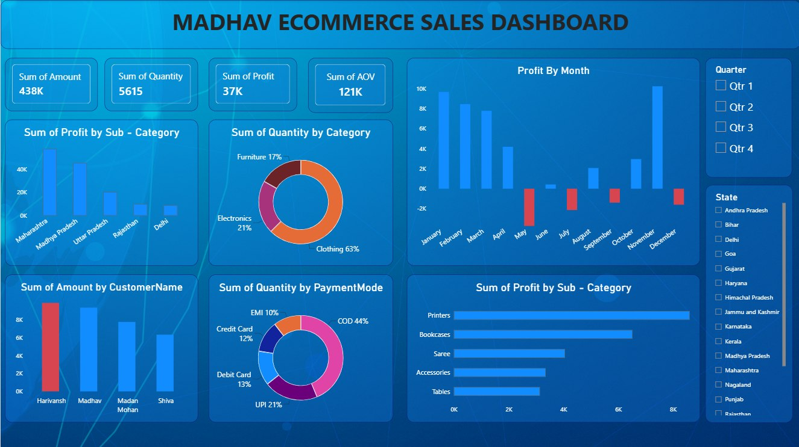

# Madhav Ecommerce Sales Dashboard

## 📊 Project Overview

An interactive Power BI dashboard built to analyze and understand Madhav Ecommerce sales performance.

The dashboard provides insights into sales, profit, quantity, customers, payment modes, categories, sub-categories, and regional performance.

## 🎯 Business Objectives

- Analyze overall sales performance
- Track total profit and quantity
- Analyze monthly profit trends
- Identify profitable sub-categories
- Analyze category-wise quantity
- Understand customer-wise sales
- Analyze payment mode usage
- Analyze state-wise performance
- Provide interactive filtering using slicers

## 🛠️ Tools & Technologies

- Power BI
- Power Query
- DAX
- Data Visualization
- Data Analysis

## 📈 Dashboard KPIs

- Total Sales
- Total Quantity
- Total Profit
- Average Order Value

## 📊 Dashboard Analysis

### Profit by Month
Analyzes monthly profit performance and helps identify changes in profitability over time.

### Profit by Sub-Category
Shows profit contribution from different sub-categories.

### Quantity by Category
Shows the distribution of sales quantity across product categories.

### Customer-wise Sales
Analyzes sales amount generated by individual customers.

### Payment Mode Analysis
Shows the distribution of transactions across different payment methods.

### State-wise Analysis
Allows users to filter and analyze performance by state.

## 🎛️ Interactive Filters

- Quarter
- State

## 📷 Dashboard Preview

## 📂 Project Files

| File | Description |
|---|---|
| `Madhav_Ecommerce_Sales_Dashboard.pbix` | Power BI dashboard project |
| `Orders.csv` | Order, sales, profit and product data |
| `Details.csv` | Customer, date and location data |
| `Madhav_Ecommerce_Dashboard.png` | Dashboard preview |

## 💡 Key Skills Demonstrated

- Data Cleaning
- Data Transformation
- Data Modeling
- DAX
- KPI Development
- Data Visualization
- Interactive Dashboard Design
- Business Data Analysis

## 👨‍💻 Author

**Swapnil Rathod**

B.Tech Computer Science & Engineering – Data Science
